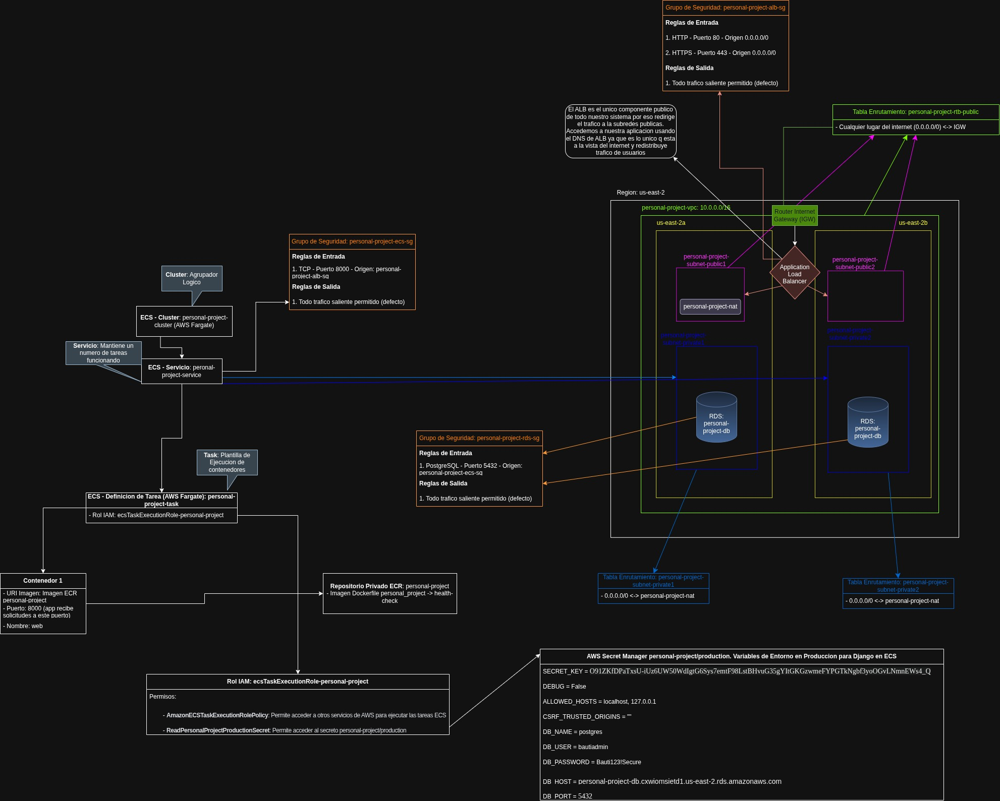

## Framework Django

### **Linter**
- ruff

### *Data Base*
- PostgreSQL

### *Arquitectura*
- Hexagonal

### *Config. gral*
- Archivo TOML

### *Contenedores*
- Docker / Docker-Compose

### *Tests unitarios*
- pytest

### *Test de aceptacion*
- Gherkins con Behave (Python)

### *Pipeline CI*
- GitHub Actions

### *Despliegue*
- Servicios AWS

A continuacion mostramos la arq. de nuestra aplicacion montada en los servicios de la nube AWS para el despliegue.

